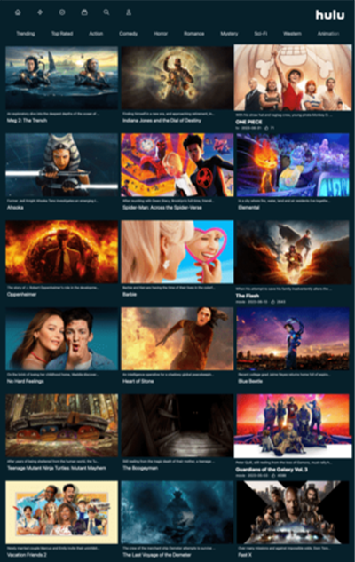
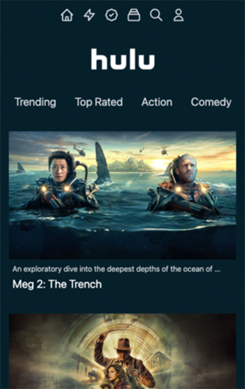

# Next.js Hulu Clone


This project is a Hulu-like web application built using Tailwind CSS, React, and Next.js. The project allows you to watch movies and TV shows online.


## Table of Contents


- [Getting Started](#getting-started)
- [Usage](#usage)
- [Screenshots](#screenshots)
- [Technologies](#technologies)
- [License](#license)
## Getting Started

To get started with this project, follow these steps:

Clone this repository to your local machine:

```bash
git clone https://github.com/berkesasa/Next.js-hulu-clone.git
```

1.Navigate to the project directory:

```bash
cd Next.js-hulu-clone
```

2.Install the required dependencies:

```bash
npm install
```

3.Start the development server:
```bash
npm run dev
```

4.Open http://localhost:3000 in your browser to view the application.


## Usage

This project provides a simple interface to list movies and TV shows. Users can browse and view details of movies and TV shows by categories.


## Screenshots

 | 
## Technologies

This project uses the following technologies:

- [Tailwind CSS](https://tailwindcss.com/): A utility-first CSS framework for building responsive web designs quickly and easily.

- [React](https://reactjs.org/): A JavaScript library for building user interfaces.

- [Next.js 13.4](https://nextjs.org/): A React framework that enables server-side rendering and other advanced features for building modern web applications.


## License

This project is licensed under the MIT License. See the [LICENSE](LICENSE) file for details.

The MIT License is an open-source license that allows you to use, modify, and distribute this project for free, as long as you include the original license text and disclaimers.
